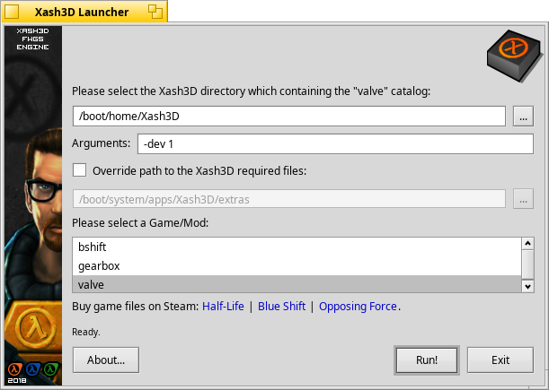
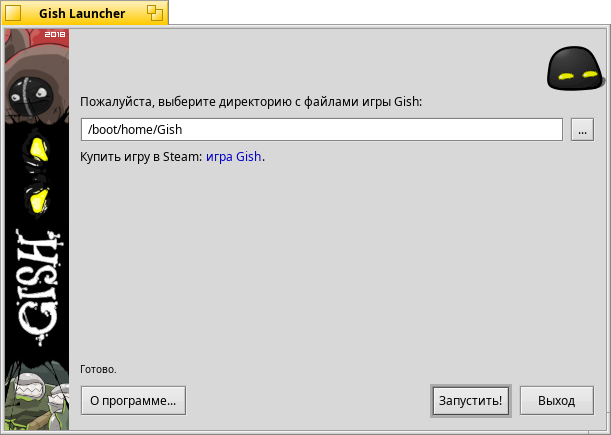
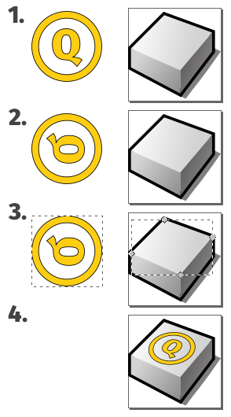

BeGameLauncher
==============

This simple framework allows you to create a special launchers for Haiku OS. It can be useful to those engaged in porting games and applications on Haiku OS and want to place its port in the repository of Haiku packages - [Haiku Depot](https://www.haiku-os.org/docs/userguide/en/applications/haikudepot.html). Such launchers allow you to select a directory with data files or set a special game options.



The target application is launched through the `Launch()` method of **BRoster** system class or `execve()` POSIX system call. Passing parameters to the executable file of program (e.g. the path to the directory with data files) is performed with using environment variables or arguments. You can fine-tune the launcher for your application via extending framework classes through a simple C++ methods overriding  practice.



Created launchers support the ability to localize into multiple languages via system [Locale Kit](https://www.haiku-os.org/docs/api/locale_intro.html). The user-specified settings are saved after exiting the launcher or starting the target application.

This is my first Haiku OS project and my first work experience with the Haiku API. Perhaps some things were done wrong and not according to well-established canons. I hope the Haiku OS development community will forgive me for that.

## Creating a custom launcher

1. Prepare the required files first:

* Banner.png (64x400 px) artwork.
* Icon.png (64x64 px) icon.
* RDef-file with vector icon and executable parameters. See this [RDef file](res/based/BasedGameLauncher.rdef) from based launcher as an example to follow.

2. When the necessary files are ready, prepare directories for resources. The `%name%` is the simplified name of your target application:

```bash
mkdir -p res/%name%/
mkdir -p locales/%name%/pre/
```

3. Now you can create a launcher itself. Copy [BasedGameLauncher.cpp](BasedGameLauncher.cpp) or [BasedGameLauncher.cpp](GishLauncher.cpp) source file to YourAppLauncher.cpp and edit it with using existing code as an example.

4. After your source file is ready, add your launcher and its parameters to the `LAUNCHERS SECTIONS` in the [CMakeLists.txt](CMakeLists.txt) file. This will allow you to start building a project.

5. Build a project once to generate the special translation cat-keys files. Ignore the CMake error about the impossibility of adding cat-keys files to `SOURCES` section. This section is needed to add cat-keys files to the project tree in different IDEs.

```bash
mkdir build/
cd build/
cmake -DLAUNCHER=%name% ..
cmake --build .
```

6. Optionally, you can translate the generated cat-keys files. They are located in the `locales/%name%/` directory. Do not forget to build the project again to add translations to the executable file of launcher.

## Tips and tricks

* You can open **CMakeLists.txt** file in the Qt Creator or KDevelop IDEs also and build your launcher by using this programs.

* You can create a vector icon for the executable file with using standard Icon-O-Matic program which is available in any distribution of Haiku OS. Use export to "HVIF RDef" feature to create a file with specially prepared string of HEX-bytes.

* You can use [Inkscape](https://inkscape.org/) program for creating a vector icon. However, new versions of Inkscape generates greatly complicated SVG file (i.e. with viewBox parameter) and it cannot be opened in Icon-O-Matic for export to RDef. But you can cheat and open in Inkscape [this SVG file](images/sources/Icon_Base.svg "Icon_Base.svg") which specially prepared by me. Just edit it as you need and be sure to save it as a **Plain SVG** file in the Inkscape. Such files can be opened in Icon-O-Matic for further editing.

* In Inkscape, you can use a very useful extention that allows you to add perspective to a selected object.



1. Create a vector object or group it from several if necessary.
2. Flip it vertically "Object => Flip Vertical", rotate to 90 degrees CW "Object => Rotate 90* CW" then convert all objects to paths via "Path => Object to Path" feature.
3. With using the "Select and Transform objects (F1)" tool select your object then hold **Shift** button and with using the "Edit path by nodes (F2)" tool select the face of the base object which you need. It will be highlighted in red frame.
4. It's time to act! Choose "Extentions => Modify Path => Perspective" and then click on the object to which the perspective was applied and select "Object => Transform => Scale => Width and Height = 80% => Apply", it should look like the image above.

*Note:* to use the perspective extention you need to install various Python libs and dependencies. Inkscape itself should prompt you how to do this.

* You can use the special pixel-stylized font "Visitor TT1 BRK" for creating inscriptions on the banner. This font looks pretty cute and earlier it was used to create a forum userbars. You can download this font from the [www.userbars.be](https://www.userbars.be/resources) site which is dedicated to creating forum userbars.

## More information

Please read [BeGameLauncher Creating Guide (in Russian)](http://exlmoto.ru/haiku-packages#launcher) for more information about creating the BeGameLauncher framework for Haiku OS.
